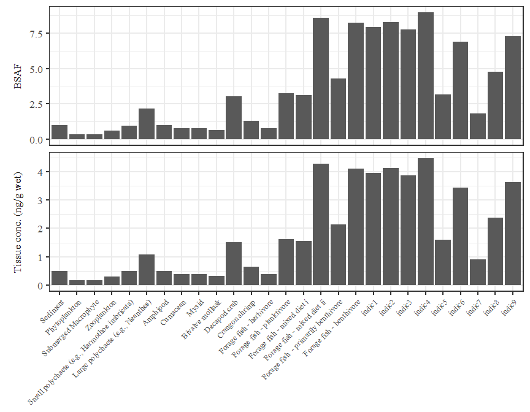

# README

[](https://travis-ci.org/SCCWRP/SQObioaccumulation)
[](https://ci.appveyor.com/project/SCCWRP/SQObioaccumulation)

Install the package as follows:

``` r
install.packages('devtools')
library(devtools)
install_github('SCCWRP/SQObioaccumulation')
library(SQObioaccumulation)
```

Run the bioaccumulation model with defaults:

``` r
# data inputs
data(biota)
data(constants)
data(contam)
data(biota_preyprop)

# calculated contaminant inputs
contamcalc <- cntcalc(contam, constants)

# run model
res <- bioaccum_batch(biota, contamcalc, biota_preyprop, constants)

# assign output to separate objects
cbiota <- res$cbiota
bsaf <- res$bsaf
```

Creat a summary table:

``` r
# summary table
indic_sum <- indic_sum_fun(cbiota, contamcalc)
indic_sum
```

    ## # A tibble: 9 x 9
    ##   Guild `Chlordanes BSA~ `Dieldrin BSAF ~ `DDTs BSAF (cal~ `PCBs BSAF (cal~
    ##   <chr>            <dbl>            <dbl>            <dbl>            <dbl>
    ## 1 indi~             5.30            2.10             11.2              9.13
    ## 2 indi~             5.45            1.99             12.4             10.0 
    ## 3 indi~             5.26            2.25              9.55             7.93
    ## 4 indi~             6.33            3.22             13.0             11.1 
    ## 5 indi~             2.28            1.21              4.43             3.84
    ## 6 indi~             5.42            3.89              7.30             6.64
    ## 7 indi~             1.40            0.924             2.05             1.84
    ## 8 indi~             4.15            3.71              3.98             4.03
    ## 9 indi~             4.75            1.70             11.6              9.32
    ## # ... with 4 more variables: `Chlordanes Conc (ng/g)` <dbl>, `Dieldrin
    ## #   Conc (ng/g)` <dbl>, `DDTs Conc (ng/g)` <dbl>, `PCBs Conc (ng/g)` <dbl>

Plot BSAF and tissue concentration estimates for a selected contaminant:

``` r
# plot of bsaf, cbiota by specific contaminant
plo_bsaf(bsaf, cbiota, 'alphaChlordane')
```

<!-- -->

Make a table of BSAF and tissue concentration estimates for a selected
contaminant:

``` r
# tabular summary of bsaf, cbiota by specific contaminant
tab_bsaf(bsaf, cbiota, 'alphaChlordane')
```

    ##                    Output Sediment Phytoplankton Submerged Macrophyte
    ## 1 Tissue conc. (ng/g wet)      0.5         0.177                0.166
    ## 2                    BSAF      1.0         0.355                0.331
    ##   Zooplankton Small polychaete (e.g., Harmothoe imbricata)
    ## 1       0.302                                        0.487
    ## 2       0.605                                        0.975
    ##   Large polychaete (e.g., Neanthes) Amphipod Cumacean Mysid
    ## 1                             1.083    0.498    0.381 0.395
    ## 2                             2.166    0.996    0.762 0.789
    ##   Bivalve mollusk Decapod crab Crangon shrimp Forage fish - herbivore
    ## 1           0.328        1.517          0.653                   0.387
    ## 2           0.655        3.035          1.305                   0.774
    ##   Forage fish - planktivore Forage fish - mixed diet i
    ## 1                     1.622                      1.558
    ## 2                     3.244                      3.115
    ##   Forage fish - mixed diet ii Forage fish  - primarily benthivore
    ## 1                       4.289                               2.144
    ## 2                       8.579                               4.288
    ##   Forage fish - benthivore indic1 indic2 indic3 indic4 indic5 indic6
    ## 1                    4.111  3.964  4.139  3.866  4.470  1.589  3.443
    ## 2                    8.223  7.929  8.279  7.732  8.941  3.179  6.886
    ##   indic7 indic8 indic9
    ## 1  0.907  2.374  3.633
    ## 2  1.814  4.747  7.266

Run Monte Carlo simulations (MCS) with results from bioaccumulation
model and additional
inputs:

``` r
mcsres <- mcs_fun(1000, indic_sum, mcsparms, constants, propseaf = c(0, 0.5, 0, 0, 0.5, 0, 0, 0, 0))
```

Summarize MCS results:

``` r
mcs_sum_fun(mcsres)
```

    ## # A tibble: 4 x 12
    ## # Groups:   Compound [4]
    ##   Compound    `0%`    `1%`   `5%`  `10%`  `25%` `50%` `75%` `90%` `95%`
    ##   <chr>      <dbl>   <dbl>  <dbl>  <dbl>  <dbl> <dbl> <dbl> <dbl> <dbl>
    ## 1 Chlorda~ 0.0946  0.183   0.285  0.361  0.509  0.736 1.09  1.58   1.92
    ## 2 DDT      0.0633  0.282   0.446  0.541  0.863  1.48  2.68  4.93   6.62
    ## 3 Dieldrin 0.593   0.885   1.27   1.52   1.98   2.87  4.04  5.70   6.96
    ## 4 PCB      0.00472 0.00905 0.0229 0.0353 0.0680 0.159 0.357 0.691  1.17
    ## # ... with 2 more variables: `99%` <dbl>, `100%` <dbl>

Plot cumulative distribution curves for
MCS:

``` r
mcs_plo(mcsres, xmax = 3)
```


Get overall SQO
assessment:

``` r
wgtavg <- wgt_avg_fun(mcsparms, propseaf = c(0, 0.5, 0, 0, 0.5, 0, 0, 0, 0))
sqo_sum_fun(wgtavg, mcsres, tischmthr, constants, finalsiteassess)
```

    ## # A tibble: 4 x 12
    ##   Compound `Weighted obser~  `25%` `50%` `75%` `Weighted estim~
    ##   <chr>               <dbl>  <dbl> <dbl> <dbl>            <dbl>
    ## 1 Chlorda~             2.28 0.509  0.736 1.09             1.68 
    ## 2 DDT                  4.85 0.863  1.48  2.68             7.17 
    ## 3 Dieldrin             0.25 1.98   2.87  4.04             0.718
    ## 4 PCB                 36.5  0.0680 0.159 0.357            5.80 
    ## # ... with 6 more variables: `Chemical exposure score` <dbl>, `Chemical
    ## #   exposure category` <chr>, `Site linkage score` <dbl>, `Site linkage
    ## #   category` <chr>, `Site assessment score` <dbl>, `Site assessment
    ## #   category` <chr>
